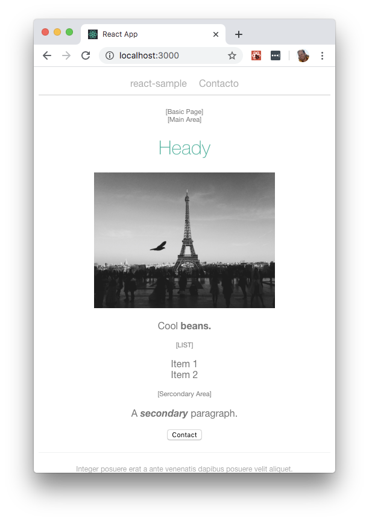

# Minimal Headless SPA Demos

The new Visual SPA Editor allows authors to edit your SPA, reducing your ongoing maintenance duties. (win!) But you get to keep everything fully headless.

This demo shows you how to use the basic features for both React and Angular.



## Pages and Components

The demo contains:

- Basic page template
- Contact page template

- Header component
- Paragraph component
- Image component
- List component
- Item component (available inside List component)
- Expander component

- Navigation component

# Setup

## Requirements

- Java (JDK)

- [Magnolia CLI](https://www.npmjs.com/package/@magnolia/cli) installed ([installation documentation](https://documentation.magnolia-cms.com/display/DOCS/Magnolia+CLI+v3))

## Install Magnolia with Magnolia CLI

In a terminal, navigate to the `magnolia` directory and run:

```
mgnl jumpstart -s
```

Choose `magnolia-community-demo-webapp` or `magnolia-dx-core-demo-webapp` as the version to download.

(Magnolia is downloaded.)

## Add the demo light modules to Magnolia

Nothing to do here!
(The Magnolia instance is pre-configured to access the existing 'light-modules' directory.)

## Start Magnolia

From within the `magnolia` start Magnolia with:

```
mgnl start
```

Once the terminal shows `Server startup in X ms`

In your browser, open Magnolia at: http://localhost:8080/magnoliaAuthor/

## Accessing Magnolia

You can log in to Magnolia using the credentials `superuser/superuser`.
This will give you complete access to all content and configuration.

To access the apps that are mentioned in these instructions use the grid icon at the top of the page, to the right of the search bar.

## Configuring REST and DAM security

### DAM

In order for images to be displayed:
Open the Security app, open the `Roles` tab, edit the `anonymous` role, go to `Web access` tab, `Add new` with this path `/dam/*` set to GET.


# Deploy your SPA to Magnolia

Build and deploy the SPA to Magnolia to make it available for editing.

### React

Go to `/spa/react-minimal` on the terminal and run `npm install`, and then `npm run deploy:mgnl`.

Once built, check that the app is deployed to `magnolia/light-modules/react-minimal-lm/webresources/build`.

See the `.env` files for important configurations.

### Angular

Go to `/spa/angular-minimal` on the terminal and run `npm install`, and then `ng build --prod`.
(If you forget the '--prod', the paths to the js and css in the created index.html will be incorrect.)

Once built, check that the app is deployed to `magnolia/light-modules/angular-minimal-lm/webresources/build`.

See the files in `/src/environments` for important configurations.

### Vue

Go to `/spa/vue-minimal` on the terminal and run `npm install`, and then `npm run deploy:mgnl`.

Once built, check that the app is deployed to `magnolia/light-modules/vue-minimal-lm/webresources/dist`.

See the `.env` files for important configurations.

> Vue example is using [vue-editor.vue](https://git.magnolia-cms.com/projects/DEMOS/repos/minimal-headless-spa-demos/browse/spa/vue-minimal/src/vue-editor.vue) to connect Vue app to Magnolia. It is a good example of creating Magnolia connector for any framework.

## Create some sample content

Either import some content, or create it manually.

### Import:

Use the 'Import' action (with nothing selected) and select the appropriate file from `/magnolia/_dev/content-to-import/`, either `website.react-minimal.yaml`, `website.angular-minimal.yaml` or `website.vue-minimal.yaml` .

### Manually:

Open the `Pages` app in Magnolia and add either

- A `React: Basic` page and name it `react-minimal`
- A `Angular: Basic` page and name it `angular-minimal`
- A `Vue: Basic` page and name it `vue-minimal`

> The page name is important as the SPA's are hardcoded to treat those names as the base of the app.

Then add components into the `Main` or `Extras` area of the page.
You can also add additional pages as children of that page.

## Running your SPA in development mode

### React

Build and start the headless React application inside `/spa/react-minimal` by running `npm start`.

### Angular

Build and start the headless Angular application inside `/spa/angular-minimal` by running `ng serve`.

### Vue

Build and start the headless Vue application inside `/spa/vue-minimal` by running `npm run serve`.

# Additional Information


## Security set up

For Magnolia version 6.2.5 and up see **Configure security** here [https://git.magnolia-cms.com/projects/DEMOS/repos/website-spa-demo/browse/README-local.md](https://git.magnolia-cms.com/projects/DEMOS/repos/website-spa-demo/browse/README-local.md).


By default, the author instance of Magnolia
(see: [Instances](https://docs.magnolia-cms.com/product-docs/Administration/Instances.html)) is restricted to authorised users.

For the purpose of this demo, we want to allow anonymous access to the REST endpoint describing the configured content.
(see: [Security](https://docs.magnolia-cms.com/product-docs/Administration/Security.html))

The endpoint is http://localhost:8080/magnoliaAuthor/.rest/pages.
Opening this while not logged in will produce the log in page.

### Content endpoint permissions

The app has anonymous access to Magnolia REST endpoints with no additional configuration because:

- "Web access" is allowed, because the restEndpoint files are under the `/delivery` path
- "Access contol list" access is allowed, beause the restEndponts have the `bypassWorkspaceAcls` property.

**NOTE** Allowing anonymous access may not be suitable for a production environment where you wish to keep data private.

### TemplateDefinitions Endpoint

If you want to debug the editing features when running the app outside of the Magnolia page editor, you will want permissions to the template-definitions endpoint:

Open the Security app, open the Roles tab, edit the `rest-anonymous` role, go to `Web access` tab, `Add new` with this path `/.rest/template-definitions*` set to GET.

(Perform similar steps if you would like to use the `template-annotations` endpoint.)
